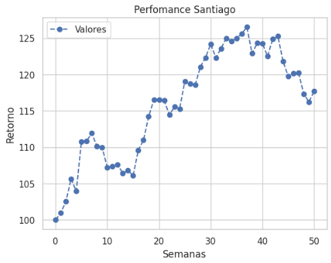
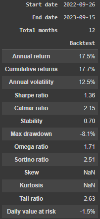

# Santiago

Na busca contínua por uma alquimia moderna nos mercados financeiros, nasce o Algoritmo Santiago. Inspirado na jornada épica descrita por Paulo Coelho em "O Alquimista", este algoritmo incorpora uma estratégia meticulosamente elaborada, assim como o protagonista da famosa obra, para desvendar os segredos ocultos das flutuações do mercado. Ao coletar um vasto espectro de dados financeiros de todo o mundo, o Algoritmo Santiago adota um processo de transformação cuidadosamente orquestrado, desde a purificação dos dados até a projeção de tendências futuras. Com o objetivo de maximizar o retorno ajustado ao risco, essa abordagem holística, baseada em análise avançada e modelagem inteligente, busca não apenas prever o desempenho das ações, mas também otimizar a composição do portfólio, seguindo os princípios consagrados da Teoria Moderna do Portfólio de Markowitz. Neste cenário de complexidade e volatilidade, o Algoritmo Santiago emerge como uma ferramenta completa e robusta, destinada a desvendar os mistérios do mercado financeiro e transformar dados em ouro para os investidores astutos.

A primeira etapa consiste em submeter esses dados a um rigoroso processo de pré-processamento. Esse procedimento tem como objetivo identificar informações altamente relevantes para cada ativo específico. Após a conclusão da limpeza e depuração dos dados, avançamos para a segunda etapa, onde aplicamos uma Variational Autoencoder (VAE). Essa rede neural generativa desempenha um papel crucial, permitindo-nos gerar dados sintéticos e criar representações de alto nível dos dados para o nosso modelo.

Além disso, utilizamos técnicas de Análise de Componentes Principais (PCA) para extrair informações adicionais e características significativas dos dados. Essas novas variáveis são cuidadosamente incorporadas ao conjunto original de dados, enriquecendo nossa base de conhecimento.

A partir deste ponto, entramos em uma fase crucial, onde selecionamos as variáveis que apresentam forte correlação com o preço das ações que estamos buscando prever. Após a normalização dos dados, nossa arquitetura incorpora a tecnologia LSTM (Long Short Term Memory), um modelo poderoso que nos permite realizar análises de regressão e projetar tendências futuras. É importante destacar que esta etapa é apenas uma parte integrante do algoritmo geral.

Esse procedimento é repetido para várias ações no mercado, proporcionando-nos a capacidade de fazer previsões diárias sobre o desempenho das ações. Em seguida, aplicamos uma estratégia de alocação de portfólio para ajustar as ponderações de cada ativo. Nosso principal objetivo ao fazer isso é maximizar o Índice de Sharpe, seguindo os princípios da Teoria Moderna do Portfólio de Markowitz.

Em resumo, nosso algoritmo não apenas realiza previsões de desempenho de ações, mas também incorpora uma estratégia de alocação de portfólio que visa otimizar o retorno ajustado ao risco. A combinação de pré-processamento de dados, engenharia de características, modelagem com LSTM e estratégia de portfólio torna nossa abordagem completa e robusta na busca por melhores resultados nos mercados financeiros.

## Perfomance

A dedicação incansável do algoritmo Santiago à estratégia meticulosamente elaborada resultou em um retorno extraordinário de 17.67% ao longo do período de análise, superando significativamente o desempenho estagnado do Ibovespa. Esta taxa de retorno excepcional também se destaca quando comparada aos modestos rendimentos do CDI e às taxas de juros brasileiras.

O índice de Sharpe, um indicador crucial para medir o desempenho ajustado ao risco, atingiu uma impressionante marca de 1.36, o que reflete a capacidade do algoritmo de gerar retornos consistentes e superiores em relação à volatilidade assumida. Além disso, o índice de Sortino, uma métrica que leva em consideração apenas a volatilidade negativa, exibiu um sólido valor de 2.51, evidenciando a capacidade do algoritmo de proteger o capital contra movimentos adversos do mercado.

A abordagem holística adotada pelo algoritmo Santiago não apenas se concentra na previsão precisa do desempenho das ações, mas também se dedica a otimizar o perfil de risco-retorno por meio de uma estratégia de alocação de portfólio robusta. Ao maximizar o índice de Sharpe, o algoritmo busca garantir um equilíbrio adequado entre o risco assumido e o retorno gerado, seguindo os princípios fundamentais da teoria moderna do portfólio.

A meticulosa fusão de processamento de dados avançado, modelagem preditiva com tecnologia LSTM e uma estratégia de alocação de portfólio baseada em sólidos fundamentos financeiros estabelece o algoritmo Santiago como uma poderosa ferramenta no universo do mercado financeiro. Seu sucesso notável no enfrentamento de mercados voláteis e imprevisíveis atesta sua capacidade de adaptar-se às complexidades em constante evolução do cenário econômico global.

"Quando você quer alguma coisa, todo o Universo conspira para que você realize o seu desejo." - Paulo Coelho 
